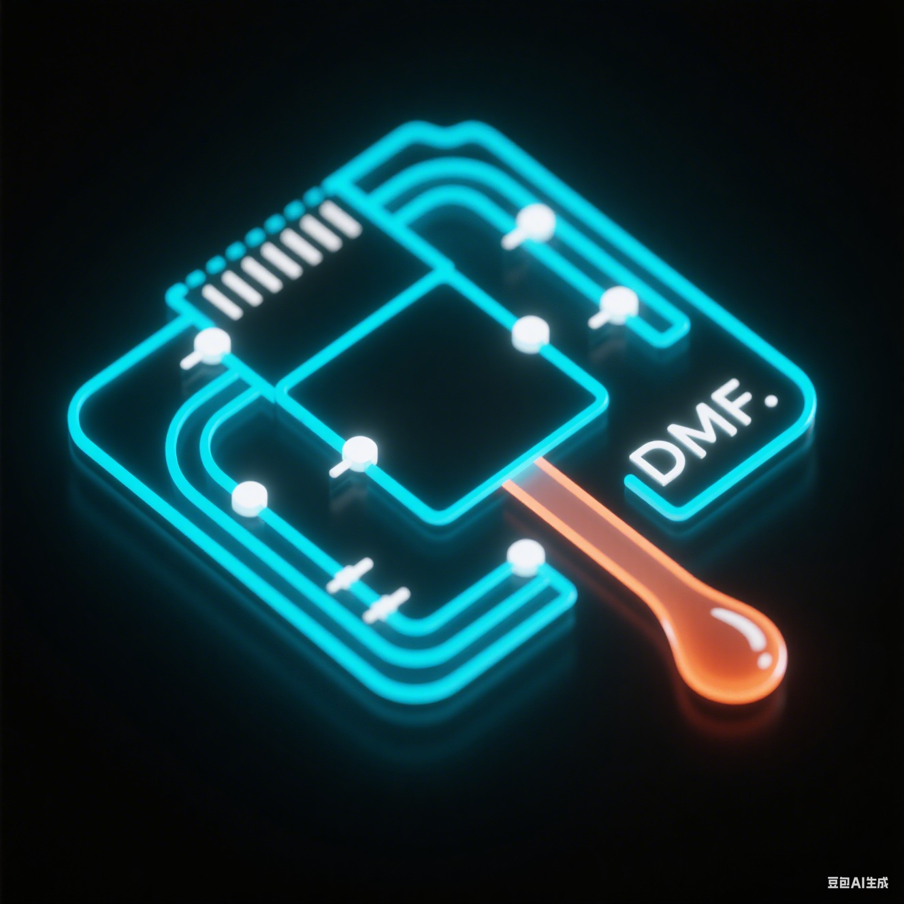

# EWOD 实验控制台

<p align="center">
  
</p>

<p align="center">
  玻璃基驱动线路板专用驱动器 · 数字微流控实验控制平台
</p>

<p align="center">
  
  
  
</p>

## 项目简介

这是一个基于 PyQt5 的 EWOD（Electrowetting-on-Dielectric）数字微流控实验控制软件，用于串口通信、芯片电极驱动、液滴移动、相机采集、温度 PID 控制、荧光读取和实验数据管理。

## 功能模块

| 模块 | 能力 |
| --- | --- |
| 芯片电极 | 电极选择、驱动、固定和液滴移动 |
| 串口驱动 | 串口扫描、连接、关闭和硬件指令下发 |
| 自动操作 | 编辑、保存、加载和执行实验步骤 |
| 相机采集 | 打开摄像头、拍照、录像和双击放大 |
| 温度控制 | 三通道温度曲线、功率曲线和 PID 参数 |
| 荧光检测 | 两种采样方式、LED 控制和数据保存 |
| 日志记录 | 运行日志、串口数据和错误状态展示 |

## 运行

```bash
python main_windows.py
```

建议使用 Python 3.10 或更高版本，并准备以下主要依赖：

```bash
pip install PyQt5 pyqtgraph pandas openpyxl pyserial opencv-python
```

## 打包

```bash
pyinstaller build_exe.spec
```

## 目录结构

```text
cam/             摄像头模块
chip/            芯片模型、电极布局和芯片数据
icon/            应用图标与控制图标
logger/          日志记录
main_window/     UI 构建和统一主题
serial_driver/   串口驱动
tools/           辅助工具
utils/           路径等通用工具
main_windows.py  应用入口和业务逻辑
```

## 操作提示

- 左键选择或多选电极。
- 右键驱动单个电极。
- 按住 `Ctrl` 后右键可连续执行多电极驱动。
- 手动操作页支持方向移动和缩放。
- 曲线和摄像头区域支持双击放大，按 `Esc` 关闭放大窗口。

## 版本

当前界面版本：`V2.1.0`
